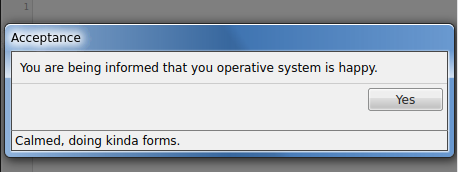
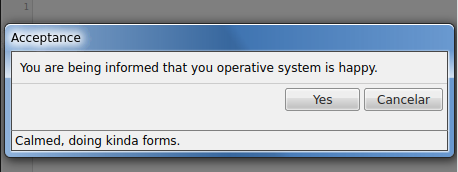
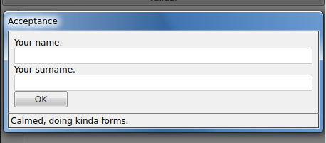

# xdialogport

This is one of the components of the xcomponents library.

## Important note

This component is very similar to [the win7dialogs API](https://github.com/allnulled/win7dialogs). In fact, it is a pretended imitation of that API. But the advantage of this component versus that API is that this component **can use** Vue.js markup. This means, all the components you define in your Vue.js are automatically available. This easies a lot the reutilization of code, and the exploitation of Vue.js algorythms.

## When to use it

This component is designed to hold the window dialogs that are opened programmatically from the app.

## How to use it

The first you need to do to use `xdialogport` is to use it in your Vue.js v2 markup:

```html
<xdialogport></xdialogport>
```

### The object API

Once you do this, and the component is `mounted`, you will have available the `this.$dialogs` (or also `this.$xdialogport`) inside all your components. With it, you can from anywhere in your app:

```js
const html = "" +
    "<xlayout>" +
    "  <xlabel>Name:</xlabel>" +
    "  <input name='name' type='text' />" +
    "  <div></div>" +
    "  <xlabel>Surname:</xlabel>" +
    "  <input name='surname' type='text' />" +
    "  <div></div>" +
    "  <button>Okay</button>" +
    "</xlayout>";
const data = await Vue.prototype.$dialogs.form({
    title: "Fast form",
    html: html,
    footer: "Calmed, doing forms."
});
console.log(data.name);
console.log(data.surname);
```

You also have the methods `confirm` and `inform`. Here are some demos.

```js
const html = "" +
    "<xlayout>" +
    "  <xlabel>Are you sure you want it?</xlabel>" +
    "</xlayout>";
const confirmation = await Vue.prototype.$dialogs.confirm({
    title: "Confirmation",
    html: html,
    button_accept: "Yes",
    button_reject: "No",
    footer: "Calmed, doing more forms."
});
if(confirmation) {
    console.log("Yes? OK, let's do it.");
} else {
    console.log("No? OK, another day maybe, then.");
}
```

The `inform` method is the simplest, and only allows you to accept.

```js
const html = "" +
    "<xlayout>" +
    "  <xlabel>You are being informed that you operative system is happy.</xlabel>" +
    "</xlayout>";
const accept = await Vue.prototype.$dialogs.inform({
    title: "Acceptance",
    html: html,
    button_accept: "Yes",
    footer: "Calmed, doing kinda forms."
});
```

### The arguments API

The arguments API works the same way. The only thing that changes is that it accepts this order of parameters, instead of an object containing them labeled:

 - html: `String` *required*. This field accepts Vue.js markup. All of them are Vue.js markup, in fact.
 - title: `String` or `"Message"`. Title of the window. 
 - footer: `String` or `false`. Footer of the window.
 - button_accept: `String` or `"Aceptar"`. Accept button text.
 - button_reject: `String` or `"Cancelar"`. Reject button text.

## Images

The `Vue.prototype.$dialogs.inform` method looks like this:



The `Vue.prototype.$dialogs.confirm` method looks like this:



The `Vue.prototype.$dialogs.form` method looks like this:


